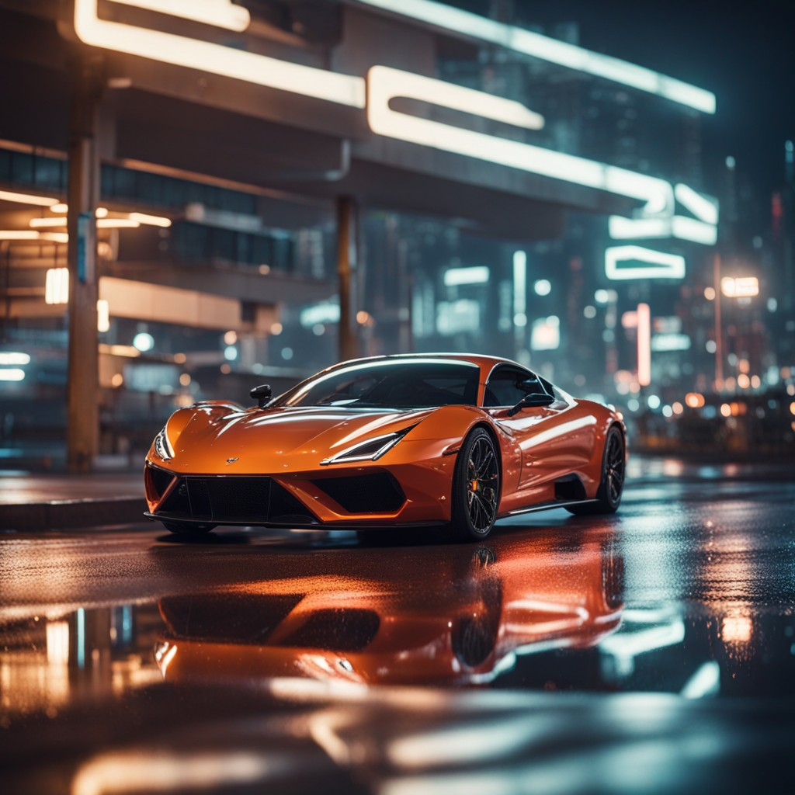

# Stable Diffusion Image Generation (CLI)


A lightweight **Python command-line tool** that generates high-quality AI images from natural language prompts using **Stable Diffusion via NVIDIA AI API**.

This project demonstrates how modern **Generative AI models** can be integrated into a simple developer workflow. Users enter a prompt in the terminal, the system sends the request to the Stable Diffusion model through NVIDIA’s API, generates an image, saves it locally, and automatically opens the result for viewing.

The goal of this project is to provide a **clean, minimal, and practical implementation of AI-powered image generation using Python**.

---

# Key Features

- Generate AI images directly from **natural language prompts**
- Powered by **Stable Diffusion (text-to-image model)**
- Integrated with **NVIDIA AI API**
- Simple **Command Line Interface (CLI)**
- Automatically **saves generated images**
- Automatically **opens generated images**
- Secure API key management using **environment variables**
- Easy to extend for **future AI features**

---

# Project Architecture

The workflow of this project is simple and efficient:

1. The user enters a prompt in the terminal.
2. The Python script sends the prompt to the **NVIDIA AI API**.
3. The **Stable Diffusion model** generates an image based on the prompt.
4. The API returns the image encoded in **Base64 format**.
5. The script decodes the image and saves it locally.
6. The generated image automatically opens for viewing.

This demonstrates a full **end-to-end integration of a generative AI model with a Python application**.

---

# Project Structure

```
Stable_diffusion_image_generation
│
├── generator.py
├── requirements.txt
├── prompt.txt
├── .env.example
├── .gitignore
├── README.md
│
└── examples
    ├── Car_Image.png
```

---

# Installation

## 1. Clone the Repository

```bash
git clone https://github.com/ronitmaheshwari05/Stable_diffusion_image_generation.git
cd Stable_diffusion_image_generation
```

---

## 2. Install Dependencies

Install required Python libraries:

```bash
pip install -r requirements.txt
```

Dependencies include:

- `requests`
- `python-dotenv`

---

# API Key Setup

This project requires an **NVIDIA API Key**.

Create a `.env` file in the project root directory.

```
NVIDIA_API_KEY=your_api_key_here
```

You can also copy the example file:

```bash
cp .env.example .env
```

Then add your API key.

---

# Usage

Run the script from the terminal:

```bash
python generator.py
```

Enter a prompt when asked.

Example:

```
Enter your prompt:
Ultra-realistic 8K cinematic photograph of a luxury sports car parked on a wet road at night, neon city lights reflecting on the car body, shallow depth of field, dramatic lighting, ultra detailed reflections, professional automotive photography.
```

The generated image will:

- Be saved locally
- Automatically open in your browser

---

# Example Prompt

```
Ultra-realistic 8K cinematic photograph of a luxury sports car parked on a wet road at night, neon city lights reflecting on the car body, shallow depth of field, dramatic lighting, ultra detailed reflections, professional automotive photography.
```

---

# Example Output



---

# Future Improvements

Planned features for future versions:

- Generate **multiple images per prompt**
- Add **negative prompts**
- Support **different Stable Diffusion models**
- Build a **web interface using Streamlit or Gradio**
- Add **prompt enhancement using LLMs**
- Create an **image gallery viewer**
- Allow **image size and style customization**
- Automatic watermarking of generated images.

---

# Use Cases

This project can be used for:

- Learning **Generative AI workflows**
- Experimenting with **Stable Diffusion APIs**
- Building **AI-powered creative tools**
- Rapid **AI image prototyping**
- Integrating AI models into Python applications

---


## Contributing

Contributions are welcome! 🚀

If you would like to improve this project, feel free to **fork the repository**, make your changes, and submit a **Pull Request**.  
Bug fixes, feature improvements, and documentation updates are always appreciated.

Steps to contribute:

1. Fork the repository
2. Create a new branch
3. Make your changes
4. Submit a Pull Request

---

## Support the Project

If you found this project helpful or interesting, please consider **giving it a ⭐ on GitHub**.  
It helps the project gain visibility and motivates further development.

---


---

# Author

Created by **Ronit Maheshwari**

Computer Science student specializing in **Artificial Intelligence and Machine Learning**.
